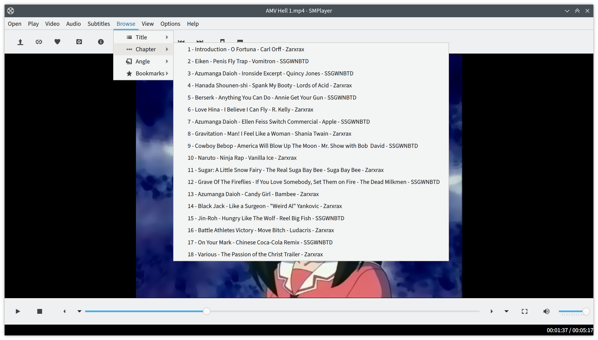

# How to apply chapters to a video



## Single file

Example for AMV Hell 1:

```sh
ffmpeg -i "~/Videos/AMV Hell Ultimate Collection/AMV Hell 1.avi" \
       -i "ffmeta/AMV Hell 1.avi.txt" \
       -map_metadata 1 -codec copy \
       "~/Videos/AMV Hell Ultimate Collection/AMV Hell 1 (with chapters).mp4  
```

AMV Hell 3 seemingly has a sync problem, it's recommended to add `-fflags +genpts` options and create a mkv file.

```sh
ffmpeg -i "~/Videos/AMV Hell Ultimate Collection/AMV Hell 3 - The Motion Picture.avi" \
       -i "ffmeta/AMV Hell 3 - The Motion Picture.avi.txt" \
       -map_metadata 1 -codec copy \
       "~/Videos/AMV Hell Ultimate Collection/AMV Hell 3 (with chapters).mkv
```

Please note: AVI does not support chapters so when converting AVI,
the destination file should be in a different container like mp4 or mkv.

## AMV Hell Ultimate Collection

To convert all supported files at once:

```sh
python bin/apply.py "~/Videos/AMV Hell Ultimate Collection" "~/Videos/AMV Hell With Chapters"
```
